Gossip protocols, Epidemic Broadcast and Eventual Consistency in Practice
-------------------------------------------------------------------------

Mariano Guerra

`event-fabric.com <https://event-fabric.com>`_

About: Riak Core Metadata
-------------------------

Not About
---------

.. figure:: riak_ring.png
    :align: center
    :width: 80%

Riak Core Metadata
------------------

* Namespaced Key-Value Store
* Replicated to **all** nodes

  + Eventually
  + Asynchronously

* In memory (ETS)
* On disk (DETS)
* Local Read/Writes

How did I ended up here?
------------------------

Attempt #1
----------

Make riak_core run on windows

Attempt #2
----------

* Per user Rate Limiting
* Per Bucket/Key Eviction

Strategies
----------

Read Code
---------

* Grep?
* Follow calls?
* Visualizations helps

  + Yak shaving: `erlplorer <http://marianoguerra.github.io/erlplorer/>`_

Read Related Papers
-------------------

* Problem
* Vocabulary
* Alternatives
* Previous Work
* Related Theory
* Tradeoffs
* High Level Design
* "Benchmarks"

Paper Pile Bankrupcy
--------------------

::

    99 papers on the pile,
    take one,
    read it,
    follow the references,

    123 papers on the pile...

Beware!
-------

Alvaro Videla's Syndrome

Tracing
-------

    Achievement Unlocked

Tracing Setup
-------------

.. class:: prettyprint lang-bash

::

    rebar3 new rebar3_riak_core tanodb
    # add recon dependency to rebar.config
    make devrel

    # in different consoles
    make dev1-console
    make dev2-console
    make dev3-console

Tracing Setup
-------------

.. class:: prettyprint lang-bash

::

    make devrel-join
    make devrel-status
    make devrel-cluster-plan
    make devrel-cluster-commit
    make devrel-status

Tracing Execution
-----------------

Using `recon <https://github.com/ferd/recon>`_ on the 3 nodes:

* Trace all **riak_core_metadata** modules
* Ignore **lazy_tick** messages
* Log call params and returns

Tracing Execution
-----------------

.. class:: prettyprint lang-erlang

::

    ReturnTrace = fun(_) -> return_trace() end.
    % at most 1000 calls per second
    Rate = {1000, 1000}.
    recon_trace:calls([{riak_core_broadcast, '_',
        fun ([A, _]) when A /= lazy_tick -> return_trace() end},
           {riak_core_metadata_hashtree, '_', ReturnTrace},
           {riak_core_metadata_object, '_', ReturnTrace},
           {riak_core_metadata_manager, '_', ReturnTrace},
           {riak_core_metadata_exchange_fsm, '_', ReturnTrace},
           {riak_core_metadata, '_', ReturnTrace}], Rate).

Tracing Execution
-----------------

Write something in riak_core_metadata:

.. class:: prettyprint lang-erlang

::

	FullPrefix = {<<"tanodb">>, <<"mymeta">>}.
	MDKey = my_key_1.
	MDValue = <<"my metadata value">>.
	riak_core_metadata:put(FullPrefix, MDKey, MDValue).

Tracing Execution
-----------------

When the dust settles:

.. class:: prettyprint lang-erlang

::

	recon_trace:clear().

Tracing Homework
----------------

* Store logs from 3 nodes
* Annotate trace calls and returns
* Follow code from the traces
* Copy code simplify and inline it
* Draw sequence diagrams
* Draw state diagrams (for FSMs)

Observations
------------

* Understanding code is hard
* Switch strategies when stuck
* Approaches reinforce each other
* Be organized with your notes
* Try your own
* We need more tooling

What did I learn?
-----------------

The life of a metadata:put 1/3
------------------------------

.. figure:: sequence-diagram-final.png
	:align: center
	:width: 100%

The life of a metadata:put 2/3
------------------------------

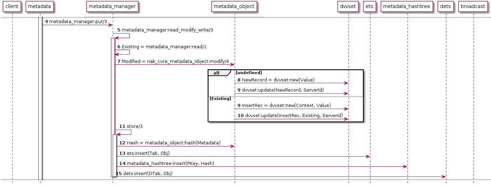

The life of a metadata:put 3/3
------------------------------

.. figure:: sequence-diagram_002.png
	:align: center
	:width: 100%

Broadcast Stage
---------------

* Implementation of paper `Epidemic Broadcast Trees <https://github.com/papers-we-love/papers-we-love/blob/master/data_structures/epidemic-broadcast-trees.pdf>`_

* Known as Plumtree

Node State
----------

* Eager Set
* Lazy Set
* Seen Msgs

Eager Push
----------

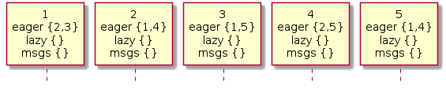

Eager Push
----------

.. figure:: plumtree-1.png
	:align: center
	:width: 100%

Eager Push
----------

.. figure:: plumtree-2.png
	:align: center
	:width: 100%

Eager Push
----------

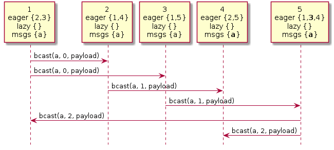

Eager Push
----------

.. figure:: plumtree-4.png
	:align: center
	:width: 100%

Eager Push
----------

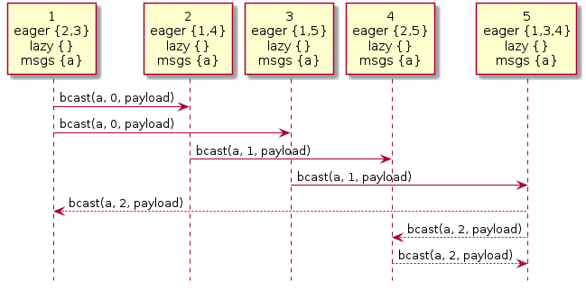

Eager Push
----------

.. figure:: plumtree-6.png
	:align: center
	:width: 100%

Eager Push
----------

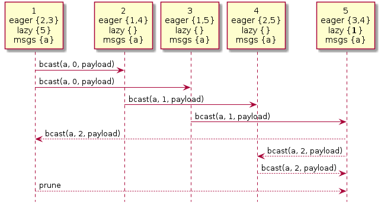

Lazy Push
---------

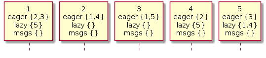

Lazy Push
---------

.. figure:: plumtree-lazy-1.png
	:align: center
	:width: 100%

Lazy Push
---------

.. figure:: plumtree-lazy-2.png
	:align: center
	:width: 100%

Lazy Push
---------

.. figure:: plumtree-lazy-3.png
	:align: center
	:width: 100%

Lazy Push
---------

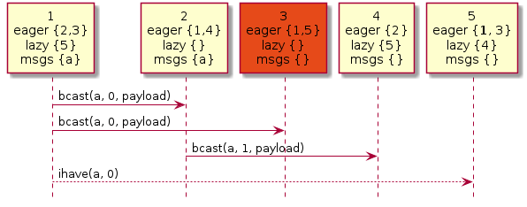

Lazy Push
---------

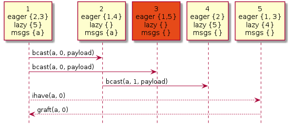

Lazy Push
---------

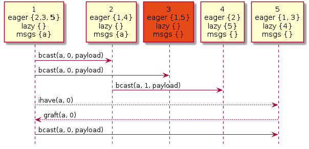

Lazy Push
---------

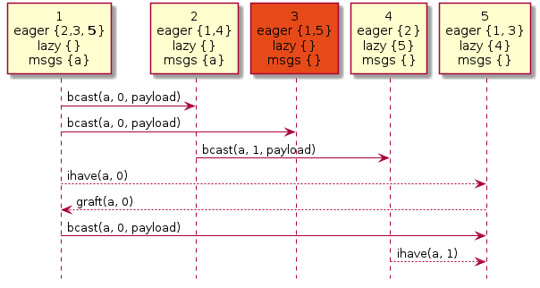

Active Anti Entropy
-------------------

How does node 3 gets the values broadcasted while he was down?

Merkle Tree
-----------

Merkle Tree
-----------

Tree in which every non-leaf node is labelled with the hash of the labels or
values (in case of leaves) of its child nodes

Merkle Tree
-----------

* Git
* IPFS
* ZFS, Btrfs
* BitTorrent
* Bitcoin, Ethereum
* Cassandra, Riak

Hash Tree
---------

.. figure:: hashtree.png
	:align: center
	:width: 100%

Segments
--------

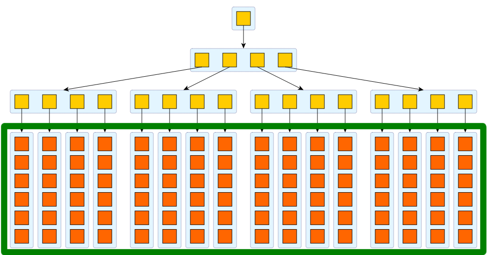

Segment Hashes
--------------

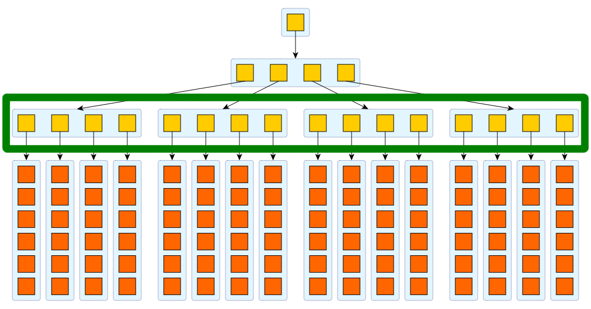

Upper Hashes
------------

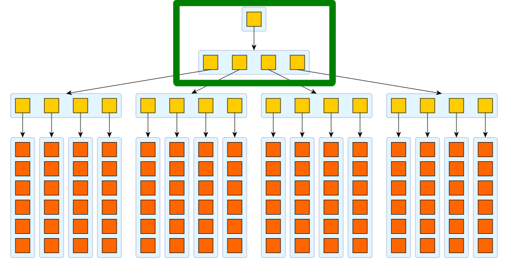

Hash Tree Operations
--------------------

* Insert
* Update
* Compare

Insert
------

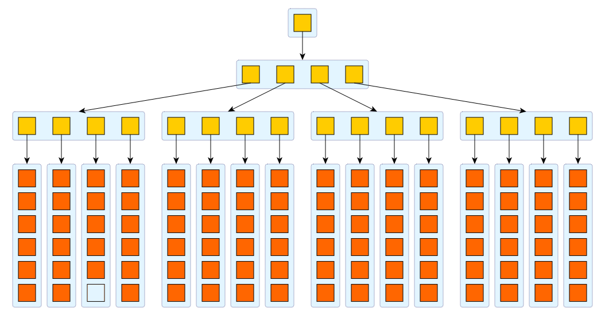

Insert
------

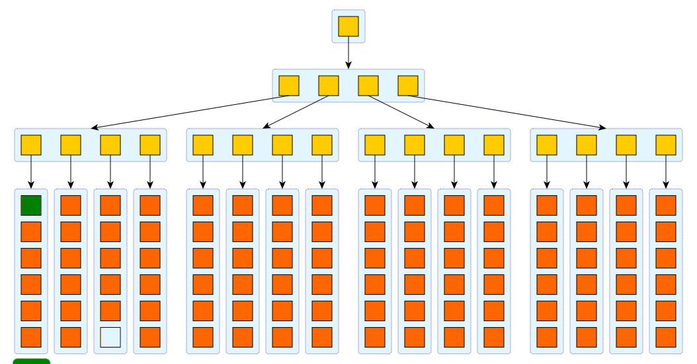

Insert
------

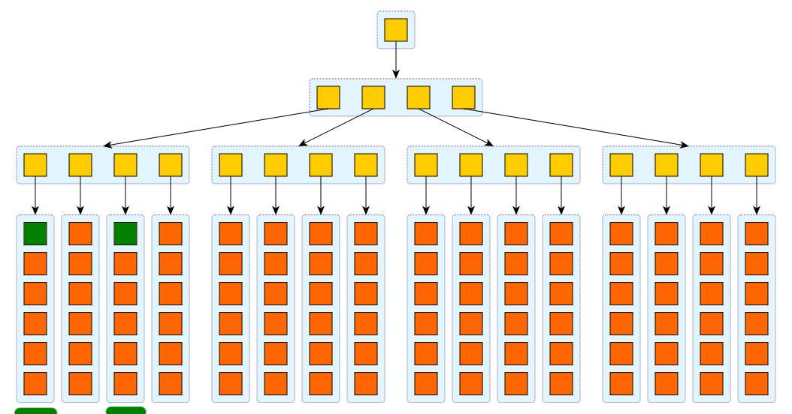

Insert
------

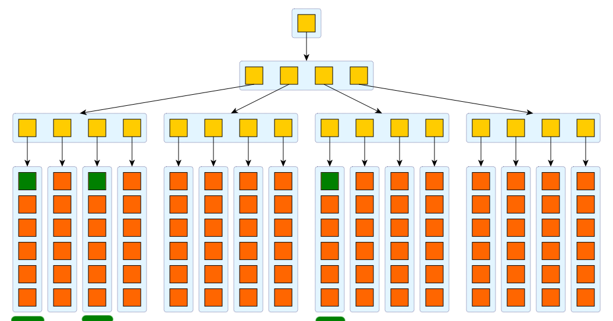

Insert
------

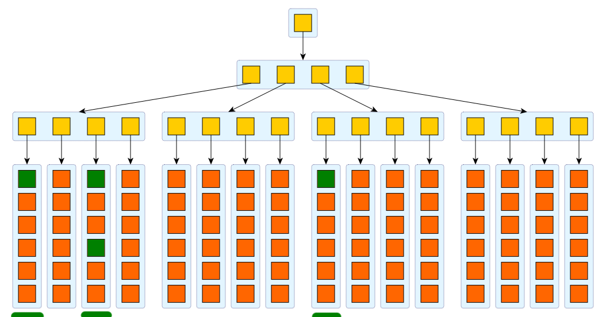

Update
------

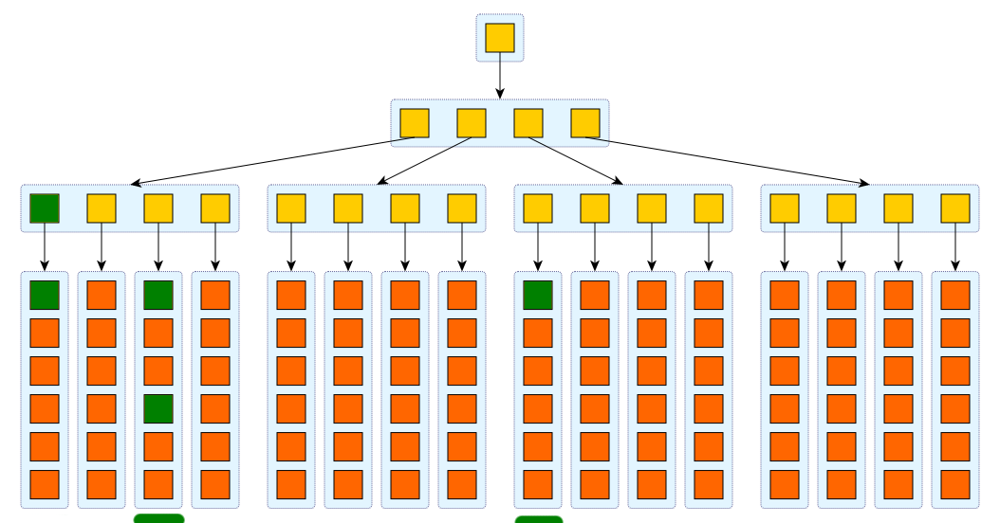

Update
------

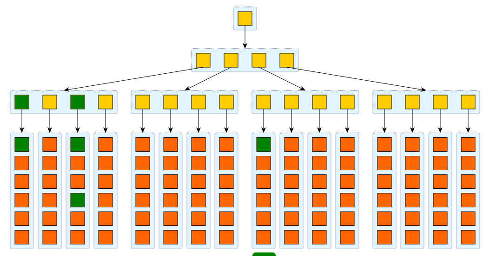

Update
------

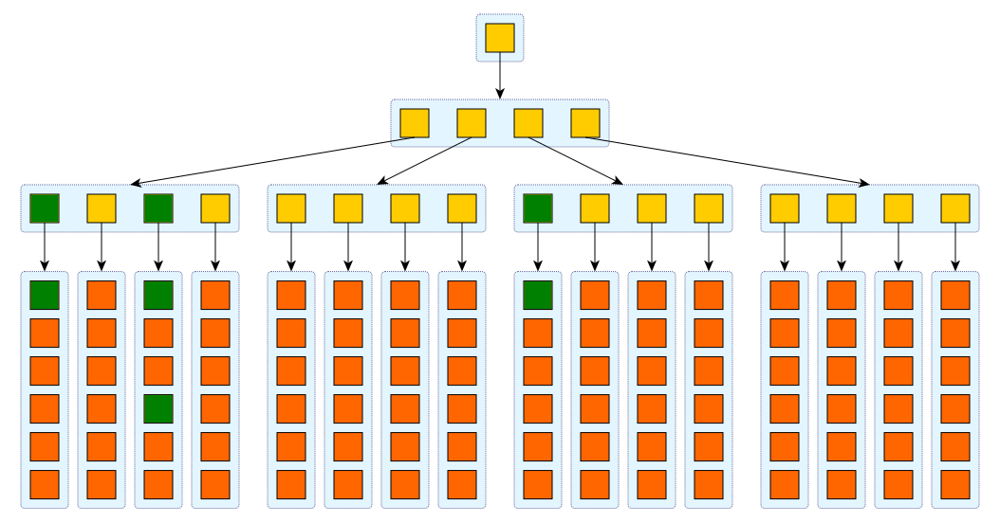

Update
------

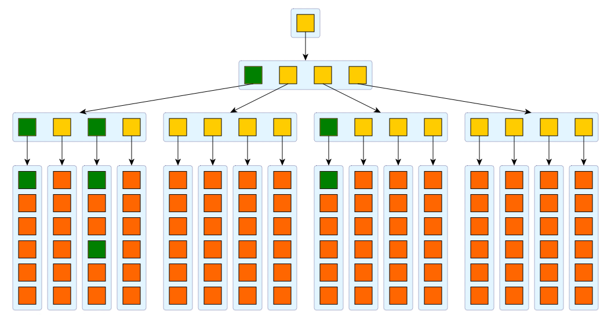

Update
------

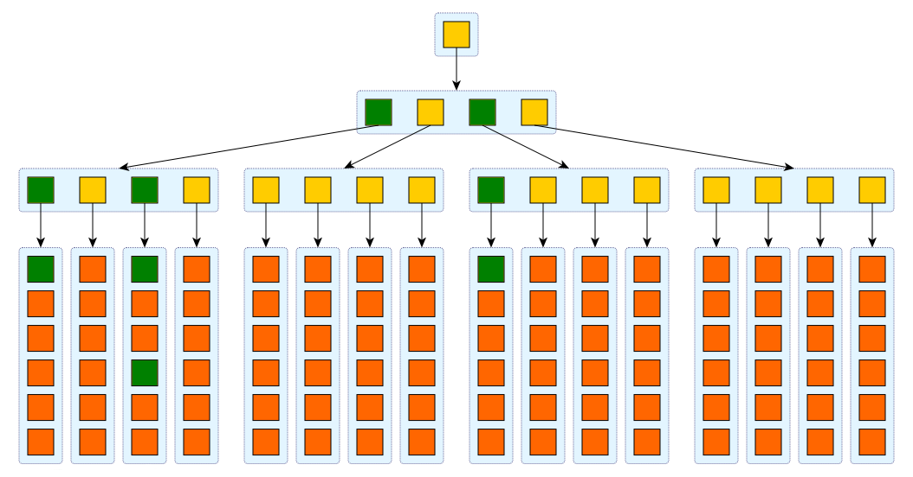

Update
------

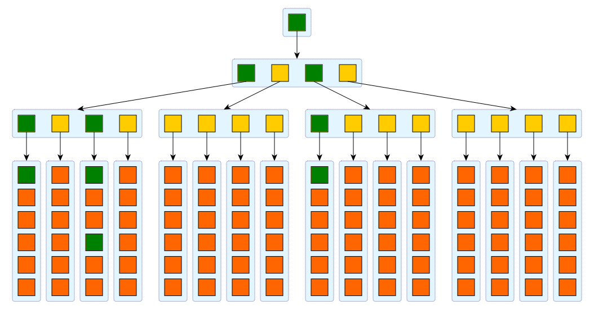

Compare
-------

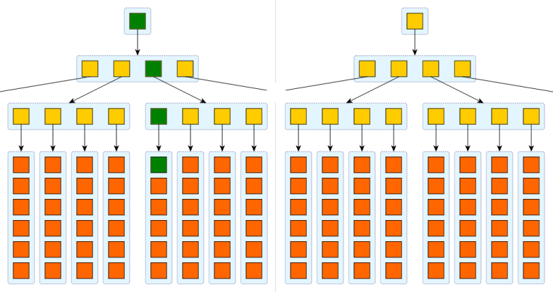

Compare
-------

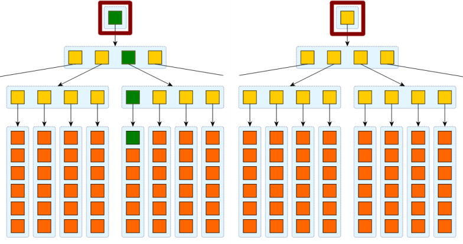

Compare
-------

.. figure:: hash-compare-3.png
	:align: center
	:width: 100%

Compare
-------

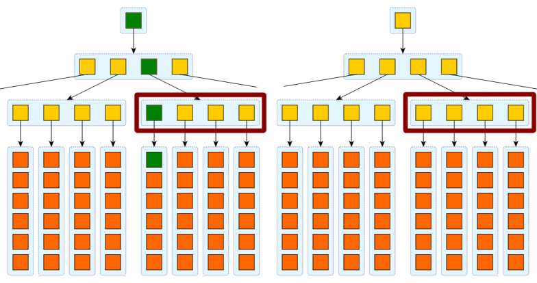

Compare
-------

.. figure:: hash-compare-5.png
	:align: center
	:width: 100%

Compare
-------

.. class:: prettyprint lang-erlang

::

    hashtree:compare(Tree, RemoteFun).
    hashtree:compare(Tree, RemoteFun, AccFun).

Did I understand it?
--------------------

Change in **riak_core_metadata_manager** from:

.. class:: prettyprint lang-erlang

::

	riak_core_metadata_hashtree:insert(PKey, Hash),
	ok = dets_insert(dets_tabname(FullPrefix), Objs);

Did I understand it?
--------------------

To:

.. class:: prettyprint lang-erlang

::

    PersistenceType = proplists:get_value(persistence_type, Opts, disk),
    case PersistenceType of
        disk ->
            riak_core_metadata_hashtree:insert(PKey, Hash),
            ok = dets_insert(dets_tabname(FullPrefix), Objs);
        memory ->
            ok
    end,

Did I understand it?
--------------------

Implemented my own **riak_core_broadcast_handler**

Add it to **advanced.config** in the **riak_core** section:

.. class:: prettyprint lang-erlang

::

    {riak_core, [
      {broadcast_mods, [riak_core_metadata_manager,
                        tanodb_broadcast_handler]}]}

Did I understand it?
--------------------

Try it:

.. class:: prettyprint lang-erlang

::

    tanodb_broadcast_handler:start_link().
    tanodb_broadcast_handler:put({{<<"tanodb">>, <<"memmeta">>},
                                 mem_key_1}, <<"my value">>).

Did I understand it?
--------------------

It works!

Papers
------

Dotted Version Vectors:

* Time, clocks and the ordering of events in a distributed system
* Virtual Time and Global States of Distributed Systems
* Dotted Version Vectors: Efficient Causality Tracking for Distributed Key-Value Stores

Papers
------

Gossip/Broadcast:

* HyParView: a membership protocol for reliable gossip-based broadcast
* Epidemic Broadcast Trees

Related Projects
----------------

* `riak_core <https://github.com/basho/riak_core>`_
* `plumtree <https://github.com/helium/plumtree>`_
* `partisan <https://github.com/cmeik/partisan>`_

Thanks
------

`@warianoguerra <https://twitter.com/warianoguerra>`_

`github.com/marianoguerra <https://github.com/marianoguerra>`_
